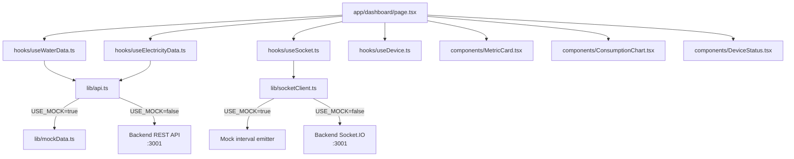

# FRONTEND SPECIFICATION
## Smart IoT-Based Water and Electricity Consumption Monitoring System
### Member 3 — Frontend Developer

---

> [!IMPORTANT]
> This document is the **sole reference** for Member 3 (Frontend Developer). All design decisions, component contracts, API integration patterns, and mock data strategies are defined here. Read every section before writing a single line of code.

---

## Table of Contents

1. [Frontend Overview](#1-frontend-overview)
2. [Technology Stack & Versions](#2-technology-stack--versions)
3. [Project Setup Commands](#3-project-setup-commands)
4. [Directory Structure](#4-directory-structure)
5. [TypeScript Type Definitions](#5-typescript-type-definitions)
6. [Mock Data Strategy](#6-mock-data-strategy)
7. [Component Specifications](#7-component-specifications)
8. [Page Specifications](#8-page-specifications)
9. [Real-Time Implementation](#9-real-time-implementation)
10. [Environment Variables](#10-environment-variables)
11. [Color Scheme and Tailwind Design](#11-color-scheme-and-tailwind-design)
12. [Responsive Design](#12-responsive-design)
13. [Member 3 Development Workflow](#13-member-3-development-workflow)
14. [Testing Plan for Member 3](#14-testing-plan-for-member-3)

---

## 1. Frontend Overview

The frontend is a **Next.js 16 App Router** single-page application that provides a real-time dashboard for monitoring IoT sensor data — specifically water flow (from a YF-S201 flow sensor) and electrical parameters streamed via an ESP32 microcontroller through a Node.js backend.

> [!IMPORTANT]
> The current implementation uses `frontend/src/app`, `frontend/src/components`, and `frontend/src/lib`. The current data layer is in `src/lib/data.ts` and the Socket.IO hook is in `src/lib/useSocket.ts`; the older root-level `app/`, `lib/api.ts`, `mockData.ts`, and `socketClient.ts` paths in this document are historical.

### Key Architectural Principles

| Principle | Implementation |
|---|---|
| **Zero backend dependency during development** | All API calls go through `lib/api.ts`, which switches between mock and real data via an env flag |
| **Real-time first** | Socket.IO client listens for live sensor events and patches local state |
| **Type-safe throughout** | Full TypeScript coverage; no `any` types except explicit library boundaries |
| **Component-driven** | Every UI piece is an isolated, testable React component with a defined props interface |
| **Mobile responsive** | Tailwind CSS mobile-first grid that collapses gracefully on small screens |

### Member 3's Scope

Member 3 **works entirely without hardware**. The backend (Member 2) and hardware firmware (Member 1) are developed in parallel. Member 3 uses:

- `lib/mockData.ts` — realistic fake sensor readings for every endpoint
- `NEXT_PUBLIC_USE_MOCK_API=true` — flips the entire API layer to mock mode
- A mock socket emitter (in `lib/socketClient.ts`) that fires fake events on an interval

When all three members integrate, Member 3 sets `NEXT_PUBLIC_USE_MOCK_API=false` and the app connects to the real backend with zero code changes.

---

## 2. Technology Stack & Versions

### Core Framework

| Package | Version | Reason for Choice |
|---|---|---|
| **Next.js** | `16.3.6` | App Router frontend used by the current repository. |
| **React** | `19.2.8` | Current runtime used by the frontend. |
| **TypeScript** | `5.x` | Provides compile-time safety for sensor data shapes, API contracts, and socket event payloads — critical when integrating with a backend developed by a separate team member. Catches integration bugs before runtime. |

### Styling

| Package | Version | Reason for Choice |
|---|---|---|
| **Tailwind CSS** | `4.x` | Utility-first styling used by the current repository. |
| **clsx** | `2.x` | Tiny utility (~300 bytes) for conditional class merging. Avoids verbose template literals when combining Tailwind classes with dynamic state-based classes (e.g., severity badge colors). |

### Data Visualization

| Package | Version | Reason for Choice |
|---|---|---|
| **Recharts** | `2.x` | Built entirely on React SVG with composable chart components. Unlike Chart.js (canvas-based), Recharts integrates natively with React state and re-renders efficiently when new socket data arrives. Its `<ResponsiveContainer>` makes charts fluid on any screen size without extra configuration. |

### Data Fetching & Caching

| Package | Version | Reason for Choice |
|---|---|---|
| **SWR** | `2.x` | Stale-While-Revalidate strategy by Vercel. Perfectly suited for polling sensor history endpoints: it shows cached data immediately, revalidates in the background, and supports `refreshInterval` for automatic polling. Zero-config deduplication prevents duplicate API calls from multiple components. |

### Real-Time

| Package | Version | Reason for Choice |
|---|---|---|
| **Socket.IO client** | `4.x` | Matches the backend Socket.IO server (Member 2's stack). Provides automatic reconnection, namespace support, and event-based API — ideal for streaming sensor readings. Falls back to long-polling if WebSocket is unavailable in the lab network. |

### Utilities

| Package | Version | Reason for Choice |
|---|---|---|
| **date-fns** | `3.x` | Tree-shakeable date utility library. Used for formatting sensor timestamps (`formatDistanceToNow`, `format`). Lighter than Moment.js and works well with TypeScript. |
| **lucide-react** | `latest` | SVG icon library with a clean, consistent design language. Each icon is a React component, meaning unused icons are tree-shaken out. Used for metric card icons (droplet, zap, thermometer, wifi, etc.). |

---

## 3. Project Setup Commands

Follow these commands **exactly** in order. All commands assume you are at the repository root.

### Step 1 — Scaffold the Next.js App

```bash
npx create-next-app@latest frontend --typescript --tailwind --eslint --app --src-dir=false --import-alias="@/*"
```

> [!NOTE]
> Flags explained:
> - `--typescript` → enables TypeScript from the start
> - `--tailwind` → installs and configures Tailwind CSS 3.4
> - `--eslint` → sets up ESLint with Next.js rules
> - `--app` → uses the App Router (NOT the legacy pages/ router)
> - `--src-dir=false` → keeps `app/` at the root level, not inside `src/`
> - `--import-alias="@/*"` → enables `@/components/...` style imports

### Step 2 — Enter the Frontend Directory

```bash
cd frontend
```

### Step 3 — Install All Required Dependencies

```bash
npm install recharts socket.io-client swr date-fns clsx lucide-react
```

### Step 4 — Install Dev Dependencies

```bash
npm install --save-dev @types/node @types/react @types/react-dom
```

### Step 5 — Verify Installations

```bash
npm list recharts socket.io-client swr date-fns clsx lucide-react
```

Expected output (versions may vary by minor):
```
frontend@0.1.0
├── clsx@2.x.x
├── date-fns@3.x.x
├── lucide-react@x.x.x
├── recharts@2.x.x
├── socket.io-client@4.x.x
└── swr@2.x.x
```

### Step 6 — Create Environment File

```bash
# Windows PowerShell
New-Item -Path .env.local -ItemType File
```

Then open `.env.local` and add the contents from [Section 10](#10-environment-variables).

### Step 7 — Run the Dev Server

```bash
npm run dev
```

App is now running at `http://localhost:3000`.

### Step 8 — Verify Tailwind Works

Open `app/page.tsx` and confirm the default Next.js template renders with styles. Then replace the file contents per [Section 8](#8-page-specifications).

---

## 4. Directory Structure

Below is the **complete file tree** for the frontend. Every file listed must be created. Files marked with `*` are the most critical.

```
frontend/
├── .env.local                          # Environment variables (never commit)
├── .env.example                        # Template for teammates
├── .eslintrc.json                      # ESLint config (auto-generated)
├── .gitignore
├── next.config.js                      # Next.js config (WebSocket rewrites)
├── tailwind.config.ts                  # Tailwind theme extensions
├── tsconfig.json                       # TypeScript config
├── package.json
│
├── app/                                # Next.js App Router root
│   ├── layout.tsx             *        # Root layout: HTML shell + Sidebar
│   ├── page.tsx               *        # Root page: redirect to /dashboard
│   ├── globals.css                     # Tailwind base + custom CSS vars
│   │
│   ├── dashboard/
│   │   └── page.tsx           *        # Main dashboard overview
│   │
│   ├── water/
│   │   └── page.tsx           *        # Water monitoring detail page
│   │
│   ├── electricity/
│   │   └── page.tsx           *        # Electricity monitoring detail page
│   │
│   ├── analytics/
│   │   └── page.tsx           *        # Weekly analytics & comparisons
│   │
│   └── anomalies/
│       └── page.tsx           *        # Anomaly list and filtering
│
├── components/                         # All reusable UI components
│   ├── DashboardHeader.tsx    *        # Page title + last-updated + breadcrumbs
│   ├── MetricCard.tsx         *        # Single stat tile (value, unit, icon, trend)
│   ├── WaterFlowCard.tsx      *        # Water sensor reading summary card
│   ├── ElectricityCard.tsx    *        # Electricity sensor reading summary card
│   ├── ConsumptionChart.tsx   *        # Line chart for single resource over time
│   ├── PowerChart.tsx         *        # Multi-line chart (P, V, I over time)
│   ├── AnomalyCard.tsx        *        # Single anomaly display with severity badge
│   ├── AlertCard.tsx                   # Inline alert/notification banner
│   ├── DeviceStatus.tsx       *        # ESP32 device health card
│   ├── TimeRangeSelector.tsx  *        # Button group: 1h / 6h / 24h / 7d / 30d
│   ├── Sidebar.tsx            *        # Left navigation sidebar
│   ├── LoadingSpinner.tsx              # Centered spinner for Suspense fallbacks
│   └── ErrorBoundary.tsx              # React error boundary wrapper
│
├── hooks/                              # Custom React hooks
│   ├── useSocket.ts           *        # Socket.IO connection + event listeners
│   ├── useWaterData.ts        *        # SWR hook for water readings history
│   ├── useElectricityData.ts  *        # SWR hook for electricity readings history
│   ├── useAnomalies.ts        *        # SWR hook for anomaly list
│   └── useDevice.ts           *        # SWR hook for device status
│
├── lib/                                # Shared utilities and data layer
│   ├── api.ts                 *        # API client (mock/real switch)
│   ├── mockData.ts            *        # All mock data for every endpoint
│   ├── utils.ts                        # Formatting helpers (numbers, dates)
│   ├── constants.ts                    # App-wide constants (routes, colors, ranges)
│   └── socketClient.ts        *        # Socket.IO singleton + mock emitter
│
└── types/
    └── index.ts               *        # All TypeScript interfaces and types
```

### Key File Relationships



---

## 5. TypeScript Type Definitions

**File:** `types/index.ts`

This is the **single source of truth** for all data shapes. Every API response, socket event, and component prop MUST reference types from this file. No inline type definitions allowed in components.

```typescript
// =============================================================================
// types/index.ts
// Smart IoT Water & Electricity Monitoring — Type Definitions
// Member 3: Frontend Developer
// =============================================================================

// ---------------------------------------------------------------------------
// ENTITY TYPES — mirror the backend Prisma models exactly
// ---------------------------------------------------------------------------

/**
 * Represents an ESP32 device registered in the system.
 * Corresponds to the `Device` table in the backend database.
 */
export interface Device {
  /** UUID primary key generated by the backend */
  id: string;
  /** Hardware identifier broadcast by the ESP32 (e.g., "ESP32_A4B3C2") */
  deviceId: string;
  /** Human-readable label assigned in the dashboard, nullable */
  name: string | null;
  /** Current connection state of the device */
  status: 'online' | 'offline';
  /** ISO 8601 timestamp of the last heartbeat received, nullable */
  lastSeenAt: string | null;
  /** WiFi signal strength in dBm (negative value; closer to 0 = stronger) */
  rssi: number | null;
  /** ESP32 free heap memory in bytes; indicates firmware health */
  freeHeap: number | null;
  /** ISO 8601 timestamp when the device was first registered */
  createdAt: string;
  /** ISO 8601 timestamp of the last record update */
  updatedAt: string;
}

/**
 * A single water flow reading from the YF-S201 sensor.
 * Corresponds to the `WaterReading` table in the backend database.
 */
export interface WaterReading {
  /** UUID primary key */
  id: string;
  /** Foreign key linking to Device.deviceId */
  deviceId: string;
  /** Instantaneous flow rate in litres per minute */
  flowRateLpm: number;
  /** Cumulative total litres since device startup or last reset */
  totalLitres: number;
  /** ISO 8601 timestamp when the sensor captured this reading */
  timestamp: string;
  /** ISO 8601 timestamp when the record was inserted into the database */
  createdAt: string;
}

/**
 * A single electricity reading from the PZEM-004T sensor.
 * Corresponds to the `ElectricityReading` table in the backend database.
 */
export interface ElectricityReading {
  /** UUID primary key */
  id: string;
  /** Foreign key linking to Device.deviceId */
  deviceId: string;
  /** AC voltage in Volts (typical range: 210–240 V in India) */
  voltage: number;
  /** AC current in Amperes */
  current: number;
  /** Active power in Watts (P = V × I × PF) */
  power: number;
  /** Cumulative energy consumed in kilowatt-hours */
  energyKwh: number;
  /** ISO 8601 timestamp when the sensor captured this reading */
  timestamp: string;
  /** ISO 8601 timestamp when the record was inserted into the database */
  createdAt: string;
}

/**
 * An anomaly event detected by the backend anomaly detection engine.
 * Corresponds to the `Anomaly` table in the backend database.
 */
export interface Anomaly {
  /** UUID primary key */
  id: string;
  /** Foreign key linking to Device.deviceId */
  deviceId: string;
  /** Which sensor type triggered the anomaly */
  resourceType: 'water' | 'electricity';
  /** Severity classification based on deviation from baseline */
  severity: 'low' | 'medium' | 'high';
  /** Human-readable description of the anomaly */
  message: string;
  /** The sensor value that triggered the anomaly */
  actualValue: number;
  /** The expected baseline value at the time of detection */
  baselineValue: number;
  /** The deviation threshold that was exceeded */
  threshold: number;
  /** ISO 8601 timestamp when the anomaly was marked resolved, or null if active */
  resolvedAt: string | null;
  /** ISO 8601 timestamp when the anomaly was detected */
  timestamp: string;
  /** ISO 8601 timestamp when the record was inserted */
  createdAt: string;
}

// ---------------------------------------------------------------------------
// API RESPONSE WRAPPERS — shape of JSON returned by the backend REST API
// ---------------------------------------------------------------------------

/**
 * Generic paginated list response wrapper used by all list endpoints.
 */
export interface PaginatedResponse<T> {
  data: T[];
  total: number;
  page: number;
  pageSize: number;
  hasNextPage: boolean;
}

/**
 * Standard success envelope wrapping a single item.
 */
export interface ApiResponse<T> {
  success: boolean;
  data: T;
  message?: string;
}

/**
 * Standard error response from the backend.
 */
export interface ApiError {
  success: false;
  error: string;
  statusCode: number;
}

/**
 * Response from GET /api/devices
 */
export type DeviceListResponse = ApiResponse<Device[]>;

/**
 * Response from GET /api/devices/:deviceId
 */
export type DeviceResponse = ApiResponse<Device>;

/**
 * Response from GET /api/water/latest
 * Returns the most recent water reading for a given device.
 */
export type WaterLatestResponse = ApiResponse<WaterReading>;

/**
 * Response from GET /api/water/history
 * Returns a time-series array of water readings.
 */
export type WaterHistoryResponse = ApiResponse<WaterReading[]>;

/**
 * Response from GET /api/water/summary
 * Returns daily/weekly aggregated water stats.
 */
export interface WaterSummary {
  todayLitres: number;
  weekLitres: number;
  avgFlowLpm: number;
  peakFlowLpm: number;
  peakFlowAt: string | null;
}
export type WaterSummaryResponse = ApiResponse<WaterSummary>;

/**
 * Response from GET /api/electricity/latest
 */
export type ElectricityLatestResponse = ApiResponse<ElectricityReading>;

/**
 * Response from GET /api/electricity/history
 */
export type ElectricityHistoryResponse = ApiResponse<ElectricityReading[]>;

/**
 * Response from GET /api/electricity/summary
 */
export interface ElectricitySummary {
  todayKwh: number;
  weekKwh: number;
  avgPowerW: number;
  peakPowerW: number;
  peakPowerAt: string | null;
  avgVoltage: number;
}
export type ElectricitySummaryResponse = ApiResponse<ElectricitySummary>;

/**
 * Response from GET /api/anomalies
 */
export type AnomalyListResponse = ApiResponse<Anomaly[]>;

// ---------------------------------------------------------------------------
// CHART DATA TYPES — shapes passed directly to Recharts components
// ---------------------------------------------------------------------------

/**
 * A single data point for a single-line time-series chart (e.g., flow rate).
 */
export interface TimeSeriesPoint {
  /** Formatted time string for the X-axis label (e.g., "14:30") */
  time: string;
  /** ISO 8601 full timestamp, used for tooltip display */
  timestamp: string;
  /** The primary value plotted on the Y-axis */
  value: number;
}

/**
 * A single data point for the multi-line electricity chart.
 */
export interface PowerChartPoint {
  time: string;
  timestamp: string;
  power: number;
  voltage: number;
  current: number;
}

/**
 * A single data point for the daily comparison bar chart on the analytics page.
 */
export interface DailyBarPoint {
  /** Short day label, e.g. "Mon", "Tue" */
  day: string;
  /** Full date string, e.g. "2026-09-15" */
  date: string;
  waterLitres: number;
  electricityKwh: number;
}

/**
 * Peak usage entry for the analytics page.
 */
export interface PeakUsageEntry {
  hour: number;
  label: string;       // e.g. "2 PM"
  waterLitres: number;
  electricityKwh: number;
}

// ---------------------------------------------------------------------------
// SOCKET.IO EVENT PAYLOADS — data received from the backend via WebSocket
// ---------------------------------------------------------------------------

/**
 * Payload emitted by the backend on the `water:reading` event.
 * Contains the latest water reading for a device.
 */
export interface WaterReadingEvent {
  deviceId: string;
  reading: WaterReading;
}

/**
 * Payload emitted by the backend on the `electricity:reading` event.
 */
export interface ElectricityReadingEvent {
  deviceId: string;
  reading: ElectricityReading;
}

/**
 * Payload emitted by the backend on the `anomaly:created` event.
 */
export interface AnomalyCreatedEvent {
  deviceId: string;
  anomaly: Anomaly;
}

/**
 * Payload emitted by the backend on the `device:status` event.
 * Fired when a device comes online or goes offline.
 */
export interface DeviceStatusEvent {
  deviceId: string;
  status: 'online' | 'offline';
  lastSeenAt: string;
  rssi?: number;
  freeHeap?: number;
}

/**
 * Union of all possible socket event names (for type-safe listeners).
 */
export type SocketEventName =
  | 'water:reading'
  | 'electricity:reading'
  | 'anomaly:created'
  | 'device:status'
  | 'connect'
  | 'disconnect'
  | 'connect_error';

// ---------------------------------------------------------------------------
// COMPONENT PROP TYPES — used by component files
// ---------------------------------------------------------------------------

/**
 * Direction of a metric trend.
 */
export type TrendDirection = 'up' | 'down' | 'stable';

/**
 * Props for the MetricCard component.
 */
export interface MetricCardProps {
  title: string;
  value: string | number;
  unit: string;
  /** lucide-react icon component */
  icon: React.ReactNode;
  trend?: {
    direction: TrendDirection;
    percentage: number;
    label?: string;
  };
  /** Tailwind color class prefix, e.g. "blue", "yellow", "green" */
  color?: 'blue' | 'yellow' | 'green' | 'red' | 'purple';
  className?: string;
  isLoading?: boolean;
}

/**
 * Props for the TimeRangeSelector component.
 */
export type TimeRange = '1h' | '6h' | '24h' | '7d' | '30d';

export interface TimeRangeSelectorProps {
  value: TimeRange;
  onChange: (range: TimeRange) => void;
  className?: string;
}

/**
 * Props for the DashboardHeader component.
 */
export interface DashboardHeaderProps {
  title: string;
  subtitle?: string;
  lastUpdated: string | null;
}

/**
 * Props for the AnomalyCard component.
 */
export interface AnomalyCardProps {
  anomaly: Anomaly;
  /** If true, shows a compact inline version instead of full card */
  compact?: boolean;
}

/**
 * Props for the ConsumptionChart component.
 */
export interface ConsumptionChartProps {
  data: TimeSeriesPoint[];
  title: string;
  unit: string;
  /** Hex color or Tailwind-compatible color string for the chart line */
  color: string;
  isLoading?: boolean;
  /** Height of the chart in pixels, defaults to 300 */
  height?: number;
}

/**
 * Props for the PowerChart component.
 */
export interface PowerChartProps {
  data: PowerChartPoint[];
  isLoading?: boolean;
  height?: number;
}

/**
 * Props for the WaterFlowCard component.
 */
export interface WaterFlowCardProps {
  reading: WaterReading | null;
  summary?: WaterSummary | null;
  isLoading: boolean;
}

/**
 * Props for the ElectricityCard component.
 */
export interface ElectricityCardProps {
  reading: ElectricityReading | null;
  summary?: ElectricitySummary | null;
  isLoading: boolean;
}

/**
 * Props for the DeviceStatus component.
 */
export interface DeviceStatusProps {
  device: Device | null;
  isLoading: boolean;
}

// ---------------------------------------------------------------------------
// HOOK RETURN TYPES — returned by custom hooks in hooks/
// ---------------------------------------------------------------------------

export interface UseWaterDataReturn {
  latestReading: WaterReading | null;
  history: WaterReading[];
  summary: WaterSummary | null;
  isLoading: boolean;
  error: Error | null;
  mutate: () => void;
}

export interface UseElectricityDataReturn {
  latestReading: ElectricityReading | null;
  history: ElectricityReading[];
  summary: ElectricitySummary | null;
  isLoading: boolean;
  error: Error | null;
  mutate: () => void;
}

export interface UseAnomaliesReturn {
  anomalies: Anomaly[];
  isLoading: boolean;
  error: Error | null;
  mutate: () => void;
}

export interface UseDeviceReturn {
  device: Device | null;
  isLoading: boolean;
  error: Error | null;
  mutate: () => void;
}

export interface UseSocketReturn {
  isConnected: boolean;
  lastWaterReading: WaterReading | null;
  lastElectricityReading: ElectricityReading | null;
  latestAnomaly: Anomaly | null;
  deviceStatus: Pick<DeviceStatusEvent, 'status' | 'lastSeenAt'> | null;
}

// ---------------------------------------------------------------------------
// UTILITY TYPES
// ---------------------------------------------------------------------------

/** Keys of the app's primary navigation routes */
export type AppRoute = '/dashboard' | '/water' | '/electricity' | '/analytics' | '/anomalies';

/** Status of an async data fetch */
export type FetchStatus = 'idle' | 'loading' | 'success' | 'error';

/** Filter state for the anomalies page */
export interface AnomalyFilter {
  resourceType: 'all' | 'water' | 'electricity';
  severity: 'all' | 'low' | 'medium' | 'high';
}
```

---

## 6. Mock Data Strategy

### Philosophy

The entire data layer lives in `lib/api.ts`. A single environment variable controls whether the app calls the real backend or returns instant mock data. **No component or hook ever calls `fetch` directly** — they all go through `api.ts`.

```
Component/Hook
     │
     ▼
  lib/api.ts  ──► NEXT_PUBLIC_USE_MOCK_API=true  ──► lib/mockData.ts  ──► instant response
                                                                              (0ms delay)
              ──► NEXT_PUBLIC_USE_MOCK_API=false ──► fetch(NEXT_PUBLIC_API_URL + endpoint)
```

### File: `lib/mockData.ts`

```typescript
// =============================================================================
// lib/mockData.ts
// Realistic mock data for all API endpoints.
// Data is modelled on a realistic home with 2-3 occupants and standard
// Indian residential power consumption patterns.
// =============================================================================

import { subMinutes, subHours, subDays, format } from 'date-fns';
import type {
  Device, WaterReading, ElectricityReading, Anomaly,
  WaterSummary, ElectricitySummary, WaterHistoryResponse,
  ElectricityHistoryResponse, AnomalyListResponse, DailyBarPoint, PeakUsageEntry
} from '@/types';

// ---------------------------------------------------------------------------
// Helper: generate an ISO string offset from now by `minutes` minutes
// ---------------------------------------------------------------------------
const isoAgo = (minutes: number): string =>
  subMinutes(new Date(), minutes).toISOString();

// ---------------------------------------------------------------------------
// DEVICE
// ---------------------------------------------------------------------------
export const MOCK_DEVICE: Device = {
  id: 'clx9z1a2b0000abc123def456',
  deviceId: 'ESP32_A4B3C2',
  name: 'Main Panel Monitor',
  status: 'online',
  lastSeenAt: isoAgo(0.5),         // 30 seconds ago
  rssi: -62,                        // -62 dBm — reasonable indoor WiFi signal
  freeHeap: 213456,                 // ~213 KB free heap (healthy ESP32)
  createdAt: subDays(new Date(), 30).toISOString(),
  updatedAt: isoAgo(0.5),
};

// ---------------------------------------------------------------------------
// WATER READINGS
// ---------------------------------------------------------------------------

/** Most recent water reading */
export const MOCK_WATER_LATEST: WaterReading = {
  id: 'wr_001',
  deviceId: 'ESP32_A4B3C2',
  flowRateLpm: 2.34,          // ~2.3 LPM — a single tap running
  totalLitres: 124.7,         // Cumulative today
  timestamp: isoAgo(0.2),     // 12 seconds ago
  createdAt: isoAgo(0.2),
};

/** Generate 60 water readings over the last hour (one per minute) */
export const MOCK_WATER_HISTORY: WaterReading[] = Array.from({ length: 60 }, (_, i) => ({
  id: `wr_hist_${i}`,
  deviceId: 'ESP32_A4B3C2',
  // Simulate morning usage peak around 7–9 AM, idle midday, evening peak
  flowRateLpm: (() => {
    const minutesAgo = 60 - i;
    const r = Math.random();
    if (minutesAgo > 45) return +(r * 3.5 + 1.5).toFixed(2);   // active usage
    if (minutesAgo > 30) return +(r * 0.3).toFixed(2);          // idle
    if (minutesAgo > 15) return +(r * 2.8 + 0.5).toFixed(2);   // moderate
    return +(r * 1.2).toFixed(2);                                // tapering
  })(),
  totalLitres: +(80 + i * 0.75 + Math.random() * 0.2).toFixed(2),
  timestamp: subMinutes(new Date(), 60 - i).toISOString(),
  createdAt: subMinutes(new Date(), 60 - i).toISOString(),
}));

/** Water daily summary */
export const MOCK_WATER_SUMMARY: WaterSummary = {
  todayLitres: 124.7,
  weekLitres: 897.3,
  avgFlowLpm: 1.87,
  peakFlowLpm: 4.12,
  peakFlowAt: subHours(new Date(), 3).toISOString(), // Morning peak
};

// ---------------------------------------------------------------------------
// ELECTRICITY READINGS
// ---------------------------------------------------------------------------

/** Most recent electricity reading */
export const MOCK_ELECTRICITY_LATEST: ElectricityReading = {
  id: 'er_001',
  deviceId: 'ESP32_A4B3C2',
  voltage: 231.4,          // Typical Indian residential voltage (~230V)
  current: 3.21,           // ~740W load (fan + lights + small appliance)
  power: 742.8,            // Watts
  energyKwh: 1.847,        // kWh consumed today
  timestamp: isoAgo(0.2),
  createdAt: isoAgo(0.2),
};

/** Generate 60 electricity readings over the last hour */
export const MOCK_ELECTRICITY_HISTORY: ElectricityReading[] = Array.from({ length: 60 }, (_, i) => {
  const baseVoltage = 230 + (Math.random() - 0.5) * 8;      // 226–234V
  const baseCurrent = 2.8 + Math.random() * 1.8;            // 2.8–4.6A
  const power = +(baseVoltage * baseCurrent * 0.92).toFixed(1); // PF ~0.92
  const kwhIncrement = power / 60000;                        // kWh per minute
  return {
    id: `er_hist_${i}`,
    deviceId: 'ESP32_A4B3C2',
    voltage: +baseVoltage.toFixed(1),
    current: +baseCurrent.toFixed(2),
    power,
    energyKwh: +(1.2 + i * kwhIncrement * 60).toFixed(3),
    timestamp: subMinutes(new Date(), 60 - i).toISOString(),
    createdAt: subMinutes(new Date(), 60 - i).toISOString(),
  };
});

/** Electricity daily summary */
export const MOCK_ELECTRICITY_SUMMARY: ElectricitySummary = {
  todayKwh: 1.847,
  weekKwh: 13.24,
  avgPowerW: 620.4,
  peakPowerW: 2340.0,    // AC or water heater spike
  peakPowerAt: subHours(new Date(), 5).toISOString(),
  avgVoltage: 230.8,
};

// ---------------------------------------------------------------------------
// ANOMALIES
// ---------------------------------------------------------------------------
export const MOCK_ANOMALIES: Anomaly[] = [
  {
    id: 'an_001',
    deviceId: 'ESP32_A4B3C2',
    resourceType: 'water',
    severity: 'high',
    message: 'Abnormal water flow detected: flow rate 4.8× above hourly baseline. Possible pipe leak or tap left open.',
    actualValue: 9.34,
    baselineValue: 1.95,
    threshold: 2.0,
    resolvedAt: null,
    timestamp: subHours(new Date(), 1).toISOString(),
    createdAt: subHours(new Date(), 1).toISOString(),
  },
  {
    id: 'an_002',
    deviceId: 'ESP32_A4B3C2',
    resourceType: 'electricity',
    severity: 'medium',
    message: 'Power spike detected: 2340W peak vs 620W baseline. May indicate high-load appliance switched on unexpectedly.',
    actualValue: 2340.0,
    baselineValue: 620.4,
    threshold: 800.0,
    resolvedAt: subHours(new Date(), 4).toISOString(),
    timestamp: subHours(new Date(), 5).toISOString(),
    createdAt: subHours(new Date(), 5).toISOString(),
  },
  {
    id: 'an_003',
    deviceId: 'ESP32_A4B3C2',
    resourceType: 'electricity',
    severity: 'low',
    message: 'Voltage fluctuation noticed: dropped to 218V for 45 seconds.',
    actualValue: 218.0,
    baselineValue: 231.0,
    threshold: 220.0,
    resolvedAt: subHours(new Date(), 8).toISOString(),
    timestamp: subHours(new Date(), 8).toISOString(),
    createdAt: subHours(new Date(), 8).toISOString(),
  },
  {
    id: 'an_004',
    deviceId: 'ESP32_A4B3C2',
    resourceType: 'water',
    severity: 'medium',
    message: 'Continuous flow detected for 45 minutes with no interruption. Check if appliance is draining continuously.',
    actualValue: 2.1,
    baselineValue: 0.0,
    threshold: 0.5,
    resolvedAt: null,
    timestamp: subHours(new Date(), 2).toISOString(),
    createdAt: subHours(new Date(), 2).toISOString(),
  },
];

// ---------------------------------------------------------------------------
// ANALYTICS — Weekly bar chart data
// ---------------------------------------------------------------------------
export const MOCK_WEEKLY_BARS: DailyBarPoint[] = Array.from({ length: 7 }, (_, i) => {
  const date = subDays(new Date(), 6 - i);
  return {
    day: format(date, 'EEE'),
    date: format(date, 'yyyy-MM-dd'),
    waterLitres: +(100 + Math.random() * 80).toFixed(1),
    electricityKwh: +(1.2 + Math.random() * 1.8).toFixed(2),
  };
});

export const MOCK_PEAK_USAGE: PeakUsageEntry[] = [
  { hour: 7,  label: '7 AM',  waterLitres: 28.4, electricityKwh: 0.42 },
  { hour: 8,  label: '8 AM',  waterLitres: 41.2, electricityKwh: 0.61 },
  { hour: 13, label: '1 PM',  waterLitres: 18.7, electricityKwh: 0.38 },
  { hour: 19, label: '7 PM',  waterLitres: 35.6, electricityKwh: 0.74 },
  { hour: 20, label: '8 PM',  waterLitres: 22.1, electricityKwh: 0.55 },
];
```

### File: `lib/api.ts`

```typescript
// =============================================================================
// lib/api.ts
// Unified API client.
// Set NEXT_PUBLIC_USE_MOCK_API=true in .env.local to use mock data.
// Set NEXT_PUBLIC_USE_MOCK_API=false to call the real backend.
// =============================================================================

import type {
  Device, WaterReading, ElectricityReading, Anomaly,
  WaterSummary, ElectricitySummary, TimeRange,
} from '@/types';
import {
  MOCK_DEVICE, MOCK_WATER_LATEST, MOCK_WATER_HISTORY, MOCK_WATER_SUMMARY,
  MOCK_ELECTRICITY_LATEST, MOCK_ELECTRICITY_HISTORY, MOCK_ELECTRICITY_SUMMARY,
  MOCK_ANOMALIES, MOCK_WEEKLY_BARS, MOCK_PEAK_USAGE,
} from './mockData';

// ---------------------------------------------------------------------------
// Configuration
// ---------------------------------------------------------------------------
const USE_MOCK = process.env.NEXT_PUBLIC_USE_MOCK_API === 'true';
const API_BASE = process.env.NEXT_PUBLIC_API_URL ?? 'http://localhost:3001';

// ---------------------------------------------------------------------------
// Internal fetch wrapper (only used when USE_MOCK=false)
// ---------------------------------------------------------------------------
async function apiFetch<T>(path: string): Promise<T> {
  const res = await fetch(`${API_BASE}${path}`, {
    headers: { 'Content-Type': 'application/json' },
    cache: 'no-store',
  });
  if (!res.ok) {
    throw new Error(`API error ${res.status}: ${res.statusText} — ${path}`);
  }
  const json = await res.json();
  // Backend wraps all responses in { success, data } envelope
  return json.data as T;
}

// ---------------------------------------------------------------------------
// DEVICE endpoints
// ---------------------------------------------------------------------------

/** GET /api/devices/ESP32_A4B3C2 */
export async function getDevice(deviceId: string): Promise<Device> {
  if (USE_MOCK) return MOCK_DEVICE;
  return apiFetch<Device>(`/api/devices/${deviceId}`);
}

/** GET /api/devices */
export async function getAllDevices(): Promise<Device[]> {
  if (USE_MOCK) return [MOCK_DEVICE];
  return apiFetch<Device[]>('/api/devices');
}

// ---------------------------------------------------------------------------
// WATER endpoints
// ---------------------------------------------------------------------------

/** GET /api/water/latest?deviceId=<id> */
export async function getWaterLatest(deviceId: string): Promise<WaterReading> {
  if (USE_MOCK) return MOCK_WATER_LATEST;
  return apiFetch<WaterReading>(`/api/water/latest?deviceId=${deviceId}`);
}

/** GET /api/water/history?deviceId=<id>&range=<1h|6h|24h|7d|30d> */
export async function getWaterHistory(deviceId: string, range: TimeRange): Promise<WaterReading[]> {
  if (USE_MOCK) return MOCK_WATER_HISTORY;
  return apiFetch<WaterReading[]>(`/api/water/history?deviceId=${deviceId}&range=${range}`);
}

/** GET /api/water/summary?deviceId=<id> */
export async function getWaterSummary(deviceId: string): Promise<WaterSummary> {
  if (USE_MOCK) return MOCK_WATER_SUMMARY;
  return apiFetch<WaterSummary>(`/api/water/summary?deviceId=${deviceId}`);
}

// ---------------------------------------------------------------------------
// ELECTRICITY endpoints
// ---------------------------------------------------------------------------

/** GET /api/electricity/latest?deviceId=<id> */
export async function getElectricityLatest(deviceId: string): Promise<ElectricityReading> {
  if (USE_MOCK) return MOCK_ELECTRICITY_LATEST;
  return apiFetch<ElectricityReading>(`/api/electricity/latest?deviceId=${deviceId}`);
}

/** GET /api/electricity/history?deviceId=<id>&range=<range> */
export async function getElectricityHistory(deviceId: string, range: TimeRange): Promise<ElectricityReading[]> {
  if (USE_MOCK) return MOCK_ELECTRICITY_HISTORY;
  return apiFetch<ElectricityReading[]>(`/api/electricity/history?deviceId=${deviceId}&range=${range}`);
}

/** GET /api/electricity/summary?deviceId=<id> */
export async function getElectricitySummary(deviceId: string): Promise<ElectricitySummary> {
  if (USE_MOCK) return MOCK_ELECTRICITY_SUMMARY;
  return apiFetch<ElectricitySummary>(`/api/electricity/summary?deviceId=${deviceId}`);
}

// ---------------------------------------------------------------------------
// ANOMALY endpoints
// ---------------------------------------------------------------------------

/** GET /api/anomalies?deviceId=<id> */
export async function getAnomalies(deviceId: string): Promise<Anomaly[]> {
  if (USE_MOCK) return MOCK_ANOMALIES;
  return apiFetch<Anomaly[]>(`/api/anomalies?deviceId=${deviceId}`);
}

// ---------------------------------------------------------------------------
// ANALYTICS endpoints
// ---------------------------------------------------------------------------

export async function getWeeklyBars(deviceId: string) {
  if (USE_MOCK) return MOCK_WEEKLY_BARS;
  return apiFetch<typeof MOCK_WEEKLY_BARS>(`/api/analytics/weekly?deviceId=${deviceId}`);
}

export async function getPeakUsage(deviceId: string) {
  if (USE_MOCK) return MOCK_PEAK_USAGE;
  return apiFetch<typeof MOCK_PEAK_USAGE>(`/api/analytics/peak?deviceId=${deviceId}`);
}

// Export the mock flag so components can display a "Mock Mode" badge
export { USE_MOCK };
```

---

## 7. Component Specifications

### 7.1 — `Sidebar.tsx`

**Purpose:** Fixed left-side navigation that links to all five app pages. Always visible on desktop; slides in as a drawer on mobile.

**Props:**
```typescript
// No external props — reads current path from next/navigation's usePathname()
```

**Visual Description:**
- Width: `w-64` on desktop, full-screen overlay on mobile
- Background: `bg-gray-900` with `text-gray-100`
- Top: App logo + "IoT Monitor" title
- Navigation items: icons + labels, active item highlighted with a colored left border (`border-l-4 border-blue-400`) and `bg-gray-800`
- Bottom: Mock Mode indicator badge (visible when `USE_MOCK=true`) in amber

**Nav Items:**
| Icon (lucide) | Label | Route |
|---|---|---|
| `<LayoutDashboard />` | Dashboard | `/dashboard` |
| `<Droplets />` | Water | `/water` |
| `<Zap />` | Electricity | `/electricity` |
| `<BarChart2 />` | Analytics | `/analytics` |
| `<AlertTriangle />` | Anomalies | `/anomalies` |

**Behavior:**
- Uses `usePathname()` from `next/navigation` to determine active route
- On mobile, a hamburger button (`<Menu />` icon) in `DashboardHeader` toggles sidebar open/closed state stored in `useState`

---

### 7.2 — `DashboardHeader.tsx`

**Purpose:** Top bar showing the current page title, subtitle, and last-updated timestamp. Also contains the mobile hamburger button.

**Props Interface:**
```typescript
interface DashboardHeaderProps {
  title: string;
  subtitle?: string;
  lastUpdated: string | null; // ISO 8601 string
}
```

**Visual Description:**
- Full-width header, `bg-white border-b border-gray-200`, padding `px-6 py-4`
- Left: Page title in `text-2xl font-bold text-gray-900`, optional subtitle in `text-sm text-gray-500`
- Right: "Last updated: {relative time}" in `text-xs text-gray-400` using `formatDistanceToNow`
- A pulsing green dot (⬤) when Socket.IO is connected, grey when disconnected

**State:** None — purely presentational.

---

### 7.3 — `MetricCard.tsx`

**Purpose:** A rectangular card displaying a single key metric (e.g., "Current Flow Rate: 2.34 LPM"). Four of these appear in the top row of the dashboard.

**Props Interface:**
```typescript
interface MetricCardProps {
  title: string;
  value: string | number;
  unit: string;
  icon: React.ReactNode;        // Lucide icon component, pre-sized
  trend?: {
    direction: 'up' | 'down' | 'stable';
    percentage: number;
    label?: string;             // e.g., "vs last hour"
  };
  color?: 'blue' | 'yellow' | 'green' | 'red' | 'purple';
  className?: string;
  isLoading?: boolean;
}
```

**Visual Description:**
- Card: `bg-white rounded-2xl shadow-sm border border-gray-100 p-6`
- Top row: small colored icon box (e.g., `bg-blue-100` with `text-blue-600` icon) on left, colored badge on right (optional)
- Middle: `value` in `text-3xl font-bold text-gray-900` followed by `unit` in `text-lg text-gray-500`
- Bottom: `title` in `text-sm text-gray-600`, then trend arrow (▲ green / ▼ red) with percentage
- Loading state: replace value with a skeleton pulse `<div className="animate-pulse bg-gray-200 h-8 w-24 rounded" />`

**Trend Logic:**
```typescript
const trendColor = trend.direction === 'up'
  ? (title.includes('Flow') || title.includes('Power') ? 'text-red-500' : 'text-green-500')
  : 'text-green-500';
// For consumption metrics, "up" is bad (red). For "signal strength", "up" is good.
// Pass the correct interpretation via context — default: "up" = bad for energy/water.
```

---

### 7.4 — `WaterFlowCard.tsx`

**Purpose:** Dedicated card for the latest water sensor reading. Shows current flow rate prominently, and total litres as a secondary figure.

**Props Interface:**
```typescript
interface WaterFlowCardProps {
  reading: WaterReading | null;
  summary?: WaterSummary | null;
  isLoading: boolean;
}
```

**Visual Description:**
- Large card, `bg-gradient-to-br from-blue-50 to-blue-100 border border-blue-200`
- Header: `<Droplets />` icon (blue-500) + "Water Flow"
- Primary stat: `flowRateLpm` value in `text-5xl font-extrabold text-blue-700` + " LPM"
- Status badge: if `flowRateLpm > 0.1`: `bg-blue-500 text-white` "● Flowing" else `bg-gray-200 text-gray-600` "○ Idle"
- Secondary row: "Total Today: `{totalLitres}` L" | "Weekly: `{weekLitres}` L" | "Peak: `{peakFlowLpm}` LPM"
- Timestamp: "Reading from {formatDistanceToNow(timestamp)} ago"
- Loading state: full skeleton

**Behavior:**
- When `reading` is `null` and not loading, display: "No data available — ensure device is online."

---

### 7.5 — `ElectricityCard.tsx`

**Purpose:** Dedicated card for the latest electricity reading. Shows voltage, current, power, and energy in a 2×2 grid.

**Props Interface:**
```typescript
interface ElectricityCardProps {
  reading: ElectricityReading | null;
  summary?: ElectricitySummary | null;
  isLoading: boolean;
}
```

**Visual Description:**
- Card: `bg-gradient-to-br from-yellow-50 to-amber-100 border border-yellow-200`
- Header: `<Zap />` icon (yellow-500) + "Electricity Monitor"
- Inner 2×2 grid:
  - Top-left: `voltage` — "231.4 **V**" with `<Activity />` icon
  - Top-right: `current` — "3.21 **A**" with `<Gauge />` icon
  - Bottom-left: `power` — "742 **W**" with `<Zap />` icon (highlighted, largest font)
  - Bottom-right: `energyKwh` — "1.847 **kWh**" with `<Battery />` icon
- Each cell has a light yellow background, rounded, with label below the value
- Footer: "Avg Voltage: {avgVoltage}V | Peak Power: {peakPowerW}W"

---

### 7.6 — `ConsumptionChart.tsx`

**Purpose:** A responsive single-line time-series chart for any scalar sensor value over time. Used for water flow history and electricity power history.

**Props Interface:**
```typescript
interface ConsumptionChartProps {
  data: TimeSeriesPoint[];     // [{time, timestamp, value}]
  title: string;
  unit: string;
  color: string;               // e.g., "#3b82f6" (blue-500) or "#eab308" (yellow-500)
  isLoading?: boolean;
  height?: number;             // default 300
}
```

**Visual Description:**
- Uses `<ResponsiveContainer width="100%" height={height ?? 300}>`
- Inside: `<LineChart data={data}>`
- `<CartesianGrid strokeDasharray="3 3" stroke="#f0f0f0" />`
- `<XAxis dataKey="time" tick={{ fontSize: 11 }} />` — shows formatted time
- `<YAxis tick={{ fontSize: 11 }} unit={` ${unit}`} width={60} />`
- `<Tooltip content={<CustomTooltip unit={unit} />} />`
- `<Line type="monotone" dataKey="value" stroke={color} strokeWidth={2} dot={false} activeDot={{ r: 4 }} />`

**Custom Tooltip:**
```typescript
const CustomTooltip = ({ active, payload, label, unit }: any) => {
  if (!active || !payload?.length) return null;
  return (
    <div className="bg-white border border-gray-200 rounded-lg p-3 shadow-lg text-sm">
      <p className="text-gray-500 mb-1">{payload[0]?.payload?.timestamp
        ? format(new Date(payload[0].payload.timestamp), 'HH:mm:ss, dd MMM')
        : label}</p>
      <p className="font-bold text-gray-900">{payload[0]?.value?.toFixed(2)} {unit}</p>
    </div>
  );
};
```

**Loading State:** Replace chart with a skeleton div `animate-pulse bg-gray-100 rounded-xl` of the same height.

**Empty State:** Show centered text "No data available for selected range."

---

### 7.7 — `PowerChart.tsx`

**Purpose:** Multi-line chart showing voltage, current, and power simultaneously over time, for the electricity detail page.

**Props Interface:**
```typescript
interface PowerChartProps {
  data: PowerChartPoint[];   // [{time, timestamp, power, voltage, current}]
  isLoading?: boolean;
  height?: number;           // default 320
}
```

**Visual Description:**
- Same `<ResponsiveContainer>` + `<LineChart>` setup as `ConsumptionChart`
- Three `<Line>` elements:
  - `power`: stroke `#f59e0b` (amber-400), strokeWidth 2.5 — primary metric
  - `voltage`: stroke `#6366f1` (indigo-400), strokeWidth 1.5
  - `current`: stroke `#10b981` (emerald-400), strokeWidth 1.5
- `<Legend />` at bottom with colored labels: "Power (W)", "Voltage (V)", "Current (A)"
- Y-axis shows power scale (left) — voltage and current use the same relative scale for visual comparison. A second Y-axis (`yAxisId="right"`) can be added for voltage if the scale difference is too large.
- Tooltip shows all three values with units.

---

### 7.8 — `AnomalyCard.tsx`

**Purpose:** Displays a single anomaly event with full detail — severity, message, resource type, actual vs baseline values, and timestamps.

**Props Interface:**
```typescript
interface AnomalyCardProps {
  anomaly: Anomaly;
  compact?: boolean;   // If true: compact one-liner for inline lists
}
```

**Severity Color Map:**
```typescript
const severityConfig = {
  high:   { bg: 'bg-red-50',    border: 'border-red-300',    badge: 'bg-red-500 text-white',    icon: <AlertOctagon className="text-red-500" /> },
  medium: { bg: 'bg-orange-50', border: 'border-orange-300', badge: 'bg-orange-500 text-white', icon: <AlertTriangle className="text-orange-500" /> },
  low:    { bg: 'bg-yellow-50', border: 'border-yellow-300', badge: 'bg-yellow-400 text-gray-900', icon: <Info className="text-yellow-500" /> },
};
```

**Full Card Visual Description:**
- Card: `rounded-xl border p-4` using severity-appropriate bg and border colors
- Header row: Severity icon | Severity badge (`HIGH / MEDIUM / LOW`) | Resource badge (`bg-blue-100 text-blue-700` for water, `bg-yellow-100 text-yellow-700` for electricity) | Resolved/Active badge at far right
- Message: `text-sm text-gray-800 font-medium mt-2`
- Details row: "Actual: {actualValue} | Baseline: {baselineValue} | Threshold: ±{threshold}"
- Footer: "Detected {formatDistanceToNow} ago" and if resolved: "• Resolved {formatDistanceToNow} ago"

**Compact Mode:**
- Single line: `[SEVERITY] [RESOURCE] Message — Time ago`
- Used in the dashboard's "Recent Anomalies" section

---

### 7.9 — `AlertCard.tsx`

**Purpose:** Inline notification banner for transient messages (e.g., "New anomaly detected", "Device went offline"). Dismissed by clicking ×.

**Props Interface:**
```typescript
interface AlertCardProps {
  type: 'info' | 'warning' | 'error' | 'success';
  title: string;
  message?: string;
  onDismiss?: () => void;
  autoDismissMs?: number;   // If set, auto-hides after this many ms
}
```

**Visual:** Full-width banner at top of page content area, color-coded by type. Slide-in animation using Tailwind `transition-all duration-300`.

---

### 7.10 — `DeviceStatus.tsx`

**Purpose:** Shows the health and connectivity state of the ESP32 device.

**Props Interface:**
```typescript
interface DeviceStatusProps {
  device: Device | null;
  isLoading: boolean;
}
```

**Visual Description:**
- Card: `bg-white rounded-2xl border p-5`
- Header: "Device Status" + `<Wifi />` icon
- Status indicator: large colored circle — `bg-green-500` for online, `bg-red-500` for offline — with pulsing animation when online (`animate-pulse`)
- Status text: "ONLINE" in `text-green-600 font-bold` or "OFFLINE" in `text-red-600`
- Device ID: monospace `font-mono text-sm text-gray-600`
- Last seen: `formatDistanceToNow(lastSeenAt)` — e.g., "30 seconds ago"
- RSSI: Signal strength bar (4 bars, filled proportionally): −50 dBm+ = 4 bars, −60 = 3, −70 = 2, −80+ = 1
- Free Heap: `{(freeHeap / 1024).toFixed(0)} KB` with a thin progress bar showing heap health

---

### 7.11 — `TimeRangeSelector.tsx`

**Purpose:** A compact button group for selecting a data time window. Used above charts on the Water and Electricity pages.

**Props Interface:**
```typescript
interface TimeRangeSelectorProps {
  value: '1h' | '6h' | '24h' | '7d' | '30d';
  onChange: (range: TimeRange) => void;
  className?: string;
}
```

**Visual Description:**
- Horizontal button group: `flex rounded-lg border border-gray-200 overflow-hidden`
- Each button: `px-3 py-1.5 text-sm font-medium transition-colors`
- Active button: `bg-blue-600 text-white`
- Inactive: `bg-white text-gray-600 hover:bg-gray-50`
- Labels: `1h | 6h | 24h | 7d | 30d`

---

### 7.12 — `LoadingSpinner.tsx`

**Purpose:** Centered loading indicator used as Suspense fallback and within cards while data loads.

**Props Interface:**
```typescript
interface LoadingSpinnerProps {
  size?: 'sm' | 'md' | 'lg';
  message?: string;
}
```

**Visual:** SVG spinner (Tailwind `animate-spin`) centered in its container. Optional message below.

---

### 7.13 — `ErrorBoundary.tsx`

**Purpose:** React class component that catches render errors in any subtree and shows a fallback UI instead of a blank page.

```typescript
interface ErrorBoundaryProps {
  children: React.ReactNode;
  fallback?: React.ReactNode;
}

interface ErrorBoundaryState {
  hasError: boolean;
  error: Error | null;
}
```

**Fallback UI:** Red-bordered card saying "Something went wrong" with the error message and a "Try Again" button that calls `window.location.reload()`.

---

## 8. Page Specifications

### 8.1 — Root Page: `app/page.tsx`

Immediately redirects to `/dashboard` using Next.js server-side redirect:

```typescript
// app/page.tsx
import { redirect } from 'next/navigation';

export default function RootPage() {
  redirect('/dashboard');
}
```

---

### 8.2 — Root Layout: `app/layout.tsx`

Wraps the entire app. Contains `<html>`, `<body>`, the `<Sidebar>` component, and the main content area.

```typescript
// app/layout.tsx
import type { Metadata } from 'next';
import { Inter } from 'next/font/google';
import './globals.css';
import Sidebar from '@/components/Sidebar';

const inter = Inter({ subsets: ['latin'] });

export const metadata: Metadata = {
  title: 'IoT Monitor — Water & Electricity',
  description: 'Smart IoT-Based Water and Electricity Consumption Monitoring System',
};

export default function RootLayout({ children }: { children: React.ReactNode }) {
  return (
    <html lang="en">
      <body className={`${inter.className} bg-gray-50 min-h-screen`}>
        <div className="flex h-screen overflow-hidden">
          <Sidebar />
          <main className="flex-1 overflow-y-auto">
            {children}
          </main>
        </div>
      </body>
    </html>
  );
}
```

---

### 8.3 — Dashboard Page: `app/dashboard/page.tsx`

**Route:** `/dashboard`

**Purpose:** The primary landing page. Shows an at-a-glance overview of all sensor data, device health, and recent anomalies.

**Layout (top to bottom):**

```
┌─────────────────────────────────────────────────────────────────┐
│  DashboardHeader: "Dashboard Overview" | Last Updated: 5s ago   │
├─────────────────────────────────────────────────────────────────┤
│  Row 1: 4 × MetricCard (grid-cols-1 sm:grid-cols-2 xl:grid-cols-4) │
│  [💧 Flow Rate: 2.34 LPM] [⚡ Power: 742W] [🔌 Voltage: 231V] [〽 Current: 3.21A] │
├─────────────────────────────────────────────────────────────────┤
│  Row 2: ConsumptionChart (60%) | PowerChart (40%)               │
│  [Water Flow — Last 1h]         [Power / Voltage / Current]    │
├─────────────────────────────────────────────────────────────────┤
│  Row 3: DeviceStatus (30%) | Recent Anomalies (70%)             │
│  [Device card]                  [Last 3 AnomalyCards compact]  │
└─────────────────────────────────────────────────────────────────┘
```

**Data Flow:**

```typescript
'use client';

// hooks used:
const { lastWaterReading, lastElectricityReading, latestAnomaly, isConnected } = useSocket();
const { latestReading: water, history: waterHistory, isLoading: waterLoading } = useWaterData('1h');
const { latestReading: elec, history: elecHistory, isLoading: elecLoading } = useElectricityData('1h');
const { anomalies } = useAnomalies();
const { device, isLoading: deviceLoading } = useDevice();
```

- `useSocket()` patches `latestReading` in real-time via socket events
- `useWaterData('1h')` polls via SWR at 30s interval for history
- Top MetricCards pull from `lastWaterReading ?? water` (prefer real-time socket data)
- Recent Anomalies shows last 3 anomalies: `anomalies.slice(0, 3)`

**MetricCard Configuration:**

```typescript
const metrics = [
  {
    title: 'Flow Rate',
    value: (lastWaterReading ?? water)?.flowRateLpm.toFixed(2) ?? '—',
    unit: 'LPM',
    icon: <Droplets className="w-6 h-6" />,
    color: 'blue',
    trend: { direction: 'up', percentage: 12, label: 'vs last hour' },
  },
  {
    title: 'Active Power',
    value: (lastElectricityReading ?? elec)?.power.toFixed(0) ?? '—',
    unit: 'W',
    icon: <Zap className="w-6 h-6" />,
    color: 'yellow',
  },
  {
    title: 'Voltage',
    value: (lastElectricityReading ?? elec)?.voltage.toFixed(1) ?? '—',
    unit: 'V',
    icon: <Activity className="w-6 h-6" />,
    color: 'purple',
  },
  {
    title: 'Current',
    value: (lastElectricityReading ?? elec)?.current.toFixed(2) ?? '—',
    unit: 'A',
    icon: <Gauge className="w-6 h-6" />,
    color: 'green',
  },
];
```

---

### 8.4 — Water Page: `app/water/page.tsx`

**Route:** `/water`

**Purpose:** Deep-dive into water consumption. Full history chart with time range selector.

**Layout:**

```
┌──────────────────────────────────────────────────────┐
│  DashboardHeader: "Water Monitoring"                 │
├──────────────────────────────────────────────────────┤
│  WaterFlowCard (full width)                          │
│  [Current: 2.34 LPM | Today: 124.7L | Peak: 4.12]  │
├──────────────────────────────────────────────────────┤
│  TimeRangeSelector: [1h] [6h] [24h] [7d] [30d]      │
├──────────────────────────────────────────────────────┤
│  ConsumptionChart: "Flow Rate Over Time"             │
│  (full width, height 360)                            │
├──────────────────────────────────────────────────────┤
│  ConsumptionChart: "Total Litres Over Time"          │
│  (full width, height 280, showing totalLitres)       │
└──────────────────────────────────────────────────────┘
```

**State:**
```typescript
const [range, setRange] = useState<TimeRange>('1h');
const { latestReading, history, summary, isLoading } = useWaterData(range);
```

**Data Transformation** (history → chart data):
```typescript
const flowChartData: TimeSeriesPoint[] = history.map(r => ({
  time: format(new Date(r.timestamp), 'HH:mm'),
  timestamp: r.timestamp,
  value: r.flowRateLpm,
}));

const litresChartData: TimeSeriesPoint[] = history.map(r => ({
  time: format(new Date(r.timestamp), 'HH:mm'),
  timestamp: r.timestamp,
  value: r.totalLitres,
}));
```

---

### 8.5 — Electricity Page: `app/electricity/page.tsx`

**Route:** `/electricity`

**Purpose:** Deep-dive into electrical parameters. Multi-line chart for all three electrical parameters over time.

**Layout:**

```
┌──────────────────────────────────────────────────────┐
│  DashboardHeader: "Electricity Monitoring"           │
├──────────────────────────────────────────────────────┤
│  ElectricityCard (full width)                        │
│  [231.4V | 3.21A | 742W | 1.847 kWh]               │
├──────────────────────────────────────────────────────┤
│  TimeRangeSelector: [1h] [6h] [24h] [7d] [30d]      │
├──────────────────────────────────────────────────────┤
│  PowerChart (full width, height 360)                 │
│  [Power W | Voltage V | Current A — multi-line]      │
├──────────────────────────────────────────────────────┤
│  ConsumptionChart: "Energy (kWh) Over Time"          │
│  (full width, height 260)                            │
└──────────────────────────────────────────────────────┘
```

---

### 8.6 — Analytics Page: `app/analytics/page.tsx`

**Route:** `/analytics`

**Purpose:** Weekly trend comparison and peak usage patterns.

**Layout:**

```
┌──────────────────────────────────────────────────────┐
│  DashboardHeader: "Analytics"                        │
├──────────────────────────────────────────────────────┤
│  Row: Summary stat boxes                             │
│  [Weekly Water: 897L] [Weekly Power: 13.2 kWh]      │
│  [Daily Avg Water: 128L] [Daily Avg Power: 1.89kWh] │
├──────────────────────────────────────────────────────┤
│  BarChart: "Water Consumption — Last 7 Days"         │
│  (Recharts BarChart with blue bars)                  │
├──────────────────────────────────────────────────────┤
│  BarChart: "Electricity Consumption — Last 7 Days"   │
│  (Recharts BarChart with yellow bars)                │
├──────────────────────────────────────────────────────┤
│  Table: "Peak Usage Hours"                           │
│  Hour | Water Litres | Electricity kWh               │
└──────────────────────────────────────────────────────┘
```

**Recharts BarChart Setup:**
```typescript
<BarChart data={weeklyBars} height={280}>
  <CartesianGrid strokeDasharray="3 3" />
  <XAxis dataKey="day" />
  <YAxis unit=" L" />
  <Tooltip />
  <Bar dataKey="waterLitres" fill="#3b82f6" radius={[4, 4, 0, 0]} name="Litres" />
</BarChart>
```

---

### 8.7 — Anomalies Page: `app/anomalies/page.tsx`

**Route:** `/anomalies`

**Purpose:** Full list of all anomaly events with filtering by resource type and severity.

**Layout:**

```
┌──────────────────────────────────────────────────────┐
│  DashboardHeader: "Anomaly Log"                      │
├──────────────────────────────────────────────────────┤
│  Filter bar:                                         │
│  Resource: [All] [Water] [Electricity]               │
│  Severity: [All] [High] [Medium] [Low]               │
│  Count: "Showing 4 of 4 anomalies"                  │
├──────────────────────────────────────────────────────┤
│  Summary row: [2 High] [1 Medium] [1 Low]            │
├──────────────────────────────────────────────────────┤
│  Scrollable list of AnomalyCard (full, not compact)  │
│  Sorted by timestamp descending (newest first)       │
└──────────────────────────────────────────────────────┘
```

**Filter State:**
```typescript
const [filter, setFilter] = useState<AnomalyFilter>({
  resourceType: 'all',
  severity: 'all',
});

const filteredAnomalies = anomalies
  .filter(a => filter.resourceType === 'all' || a.resourceType === filter.resourceType)
  .filter(a => filter.severity === 'all' || a.severity === filter.severity)
  .sort((a, b) => new Date(b.timestamp).getTime() - new Date(a.timestamp).getTime());
```

---

## 9. Real-Time Implementation

### 9.1 — `lib/socketClient.ts`

This file creates and exports a **singleton** Socket.IO client instance. A singleton ensures that even if multiple hooks or components import `socketClient`, there is exactly one WebSocket connection to the backend.

```typescript
// lib/socketClient.ts
// =============================================================================
// Socket.IO client singleton + mock mode emitter.
// Import `socket` into hooks — never call io() directly in components.
// =============================================================================

import { io, Socket } from 'socket.io-client';
import type {
  WaterReadingEvent, ElectricityReadingEvent,
  AnomalyCreatedEvent, DeviceStatusEvent,
} from '@/types';
import {
  MOCK_WATER_LATEST, MOCK_ELECTRICITY_LATEST, MOCK_ANOMALIES, MOCK_DEVICE,
} from './mockData';

const USE_MOCK = process.env.NEXT_PUBLIC_USE_MOCK_API === 'true';
const WS_URL   = process.env.NEXT_PUBLIC_WS_URL ?? 'http://localhost:3001';

// ---------------------------------------------------------------------------
// Singleton socket instance
// ---------------------------------------------------------------------------
let socket: Socket;

function getSocket(): Socket {
  if (socket) return socket;

  if (USE_MOCK) {
    // Create a disconnected socket that we'll manually emit events on
    socket = io(WS_URL, { autoConnect: false });
    startMockEmitter(socket);
  } else {
    socket = io(WS_URL, {
      transports: ['websocket', 'polling'],   // try WebSocket first, fallback to polling
      reconnection: true,
      reconnectionAttempts: 10,
      reconnectionDelay: 2000,
    });
  }

  return socket;
}

// ---------------------------------------------------------------------------
// Mock emitter — fires realistic events on an interval
// when NEXT_PUBLIC_USE_MOCK_API=true
// ---------------------------------------------------------------------------
function startMockEmitter(mockSocket: Socket): void {
  if (typeof window === 'undefined') return; // Server-side: don't run

  let totalLitres = MOCK_WATER_LATEST.totalLitres;
  let energyKwh   = MOCK_ELECTRICITY_LATEST.energyKwh;

  // Simulate "connected" state immediately
  setTimeout(() => {
    (mockSocket as any).emit('connect');
    mockSocket.connected = true;
  }, 300);

  // Emit water:reading every 5 seconds with slight variation
  setInterval(() => {
    const flowRate = +(Math.random() * 3.5).toFixed(2);
    totalLitres = +(totalLitres + flowRate / 12).toFixed(3); // +flow per 5s
    const payload: WaterReadingEvent = {
      deviceId: MOCK_DEVICE.deviceId,
      reading: {
        ...MOCK_WATER_LATEST,
        id: `mock_w_${Date.now()}`,
        flowRateLpm: flowRate,
        totalLitres,
        timestamp: new Date().toISOString(),
        createdAt: new Date().toISOString(),
      },
    };
    mockSocket.emit('water:reading', payload);
  }, 5000);

  // Emit electricity:reading every 5 seconds
  setInterval(() => {
    const voltage  = +(228 + Math.random() * 6).toFixed(1);
    const current  = +(2.5 + Math.random() * 2).toFixed(2);
    const power    = +(voltage * current * 0.92).toFixed(1);
    energyKwh = +(energyKwh + power / 720000).toFixed(4);
    const payload: ElectricityReadingEvent = {
      deviceId: MOCK_DEVICE.deviceId,
      reading: {
        ...MOCK_ELECTRICITY_LATEST,
        id: `mock_e_${Date.now()}`,
        voltage, current, power, energyKwh,
        timestamp: new Date().toISOString(),
        createdAt: new Date().toISOString(),
      },
    };
    mockSocket.emit('electricity:reading', payload);
  }, 5000);

  // Emit a random anomaly event occasionally (every 2 minutes) for demo
  setInterval(() => {
    const randomAnomaly = MOCK_ANOMALIES[Math.floor(Math.random() * MOCK_ANOMALIES.length)];
    const payload: AnomalyCreatedEvent = {
      deviceId: MOCK_DEVICE.deviceId,
      anomaly: { ...randomAnomaly, id: `mock_an_${Date.now()}`, timestamp: new Date().toISOString() },
    };
    mockSocket.emit('anomaly:created', payload);
  }, 120000);

  // Emit device:status heartbeat every 30 seconds
  setInterval(() => {
    const payload: DeviceStatusEvent = {
      deviceId: MOCK_DEVICE.deviceId,
      status: 'online',
      lastSeenAt: new Date().toISOString(),
      rssi: -60 + Math.floor(Math.random() * 10 - 5),
      freeHeap: 210000 + Math.floor(Math.random() * 10000),
    };
    mockSocket.emit('device:status', payload);
  }, 30000);
}

export { getSocket };
export type { Socket };
```

---

### 9.2 — `hooks/useSocket.ts`

```typescript
// hooks/useSocket.ts
// =============================================================================
// React hook that wraps the singleton Socket.IO client.
// Returns the latest readings from socket events.
// =============================================================================

'use client';

import { useEffect, useState, useCallback } from 'react';
import { getSocket } from '@/lib/socketClient';
import type {
  WaterReading, ElectricityReading, Anomaly,
  WaterReadingEvent, ElectricityReadingEvent,
  AnomalyCreatedEvent, DeviceStatusEvent, UseSocketReturn,
} from '@/types';

export function useSocket(): UseSocketReturn {
  const [isConnected, setIsConnected] = useState(false);
  const [lastWaterReading, setLastWaterReading] = useState<WaterReading | null>(null);
  const [lastElectricityReading, setLastElectricityReading] = useState<ElectricityReading | null>(null);
  const [latestAnomaly, setLatestAnomaly] = useState<Anomaly | null>(null);
  const [deviceStatus, setDeviceStatus] = useState<Pick<DeviceStatusEvent, 'status' | 'lastSeenAt'> | null>(null);

  useEffect(() => {
    const socket = getSocket();

    // --- Connection events ---
    const onConnect    = () => setIsConnected(true);
    const onDisconnect = () => setIsConnected(false);

    // --- Sensor data events ---
    const onWaterReading = (payload: WaterReadingEvent) => {
      setLastWaterReading(payload.reading);
    };

    const onElectricityReading = (payload: ElectricityReadingEvent) => {
      setLastElectricityReading(payload.reading);
    };

    const onAnomalyCreated = (payload: AnomalyCreatedEvent) => {
      setLatestAnomaly(payload.anomaly);
      // Optionally trigger a browser notification here (Phase 2)
    };

    const onDeviceStatus = (payload: DeviceStatusEvent) => {
      setDeviceStatus({ status: payload.status, lastSeenAt: payload.lastSeenAt });
    };

    // Register listeners
    socket.on('connect',              onConnect);
    socket.on('disconnect',           onDisconnect);
    socket.on('water:reading',        onWaterReading);
    socket.on('electricity:reading',  onElectricityReading);
    socket.on('anomaly:created',      onAnomalyCreated);
    socket.on('device:status',        onDeviceStatus);

    // Cleanup on unmount
    return () => {
      socket.off('connect',              onConnect);
      socket.off('disconnect',           onDisconnect);
      socket.off('water:reading',        onWaterReading);
      socket.off('electricity:reading',  onElectricityReading);
      socket.off('anomaly:created',      onAnomalyCreated);
      socket.off('device:status',        onDeviceStatus);
    };
  }, []);

  return { isConnected, lastWaterReading, lastElectricityReading, latestAnomaly, deviceStatus };
}
```

---

### 9.3 — `hooks/useWaterData.ts`

```typescript
// hooks/useWaterData.ts
'use client';

import useSWR from 'swr';
import { getWaterLatest, getWaterHistory, getWaterSummary } from '@/lib/api';
import { DEVICE_ID } from '@/lib/constants';
import type { TimeRange, UseWaterDataReturn } from '@/types';

export function useWaterData(range: TimeRange = '1h'): UseWaterDataReturn {
  const { data: latestReading, error: e1, mutate: m1 } = useSWR(
    `water-latest-${DEVICE_ID}`,
    () => getWaterLatest(DEVICE_ID),
    { refreshInterval: 10_000 }  // poll every 10s as backup to socket
  );

  const { data: history, error: e2, mutate: m2 } = useSWR(
    `water-history-${DEVICE_ID}-${range}`,
    () => getWaterHistory(DEVICE_ID, range),
    { refreshInterval: 30_000 }
  );

  const { data: summary, error: e3, mutate: m3 } = useSWR(
    `water-summary-${DEVICE_ID}`,
    () => getWaterSummary(DEVICE_ID),
    { refreshInterval: 60_000 }
  );

  const isLoading = !latestReading && !e1;
  const error = e1 ?? e2 ?? e3 ?? null;

  const mutate = () => { m1(); m2(); m3(); };

  return {
    latestReading: latestReading ?? null,
    history: history ?? [],
    summary: summary ?? null,
    isLoading,
    error,
    mutate,
  };
}
```

---

### 9.4 — `hooks/useElectricityData.ts`

```typescript
// hooks/useElectricityData.ts
'use client';

import useSWR from 'swr';
import { getElectricityLatest, getElectricityHistory, getElectricitySummary } from '@/lib/api';
import { DEVICE_ID } from '@/lib/constants';
import type { TimeRange, UseElectricityDataReturn } from '@/types';

export function useElectricityData(range: TimeRange = '1h'): UseElectricityDataReturn {
  const { data: latestReading, error: e1, mutate: m1 } = useSWR(
    `elec-latest-${DEVICE_ID}`,
    () => getElectricityLatest(DEVICE_ID),
    { refreshInterval: 10_000 }
  );

  const { data: history, error: e2, mutate: m2 } = useSWR(
    `elec-history-${DEVICE_ID}-${range}`,
    () => getElectricityHistory(DEVICE_ID, range),
    { refreshInterval: 30_000 }
  );

  const { data: summary, error: e3, mutate: m3 } = useSWR(
    `elec-summary-${DEVICE_ID}`,
    () => getElectricitySummary(DEVICE_ID),
    { refreshInterval: 60_000 }
  );

  const isLoading = !latestReading && !e1;
  const error = e1 ?? e2 ?? e3 ?? null;
  const mutate = () => { m1(); m2(); m3(); };

  return {
    latestReading: latestReading ?? null,
    history: history ?? [],
    summary: summary ?? null,
    isLoading,
    error,
    mutate,
  };
}
```

---

### 9.5 — `hooks/useAnomalies.ts`

```typescript
// hooks/useAnomalies.ts
'use client';

import useSWR from 'swr';
import { getAnomalies } from '@/lib/api';
import { DEVICE_ID } from '@/lib/constants';
import type { UseAnomaliesReturn } from '@/types';

export function useAnomalies(): UseAnomaliesReturn {
  const { data, error, mutate } = useSWR(
    `anomalies-${DEVICE_ID}`,
    () => getAnomalies(DEVICE_ID),
    { refreshInterval: 30_000 }
  );

  return {
    anomalies: data ?? [],
    isLoading: !data && !error,
    error: error ?? null,
    mutate,
  };
}
```

---

### 9.6 — `hooks/useDevice.ts`

```typescript
// hooks/useDevice.ts
'use client';

import useSWR from 'swr';
import { getDevice } from '@/lib/api';
import { DEVICE_ID } from '@/lib/constants';
import type { UseDeviceReturn } from '@/types';

export function useDevice(): UseDeviceReturn {
  const { data, error, mutate } = useSWR(
    `device-${DEVICE_ID}`,
    () => getDevice(DEVICE_ID),
    { refreshInterval: 15_000 }
  );

  return {
    device: data ?? null,
    isLoading: !data && !error,
    error: error ?? null,
    mutate,
  };
}
```

---

### 9.7 — `lib/constants.ts`

```typescript
// lib/constants.ts
export const DEVICE_ID = 'ESP32_A4B3C2';

export const TIME_RANGES = [
  { value: '1h',  label: '1 Hour'   },
  { value: '6h',  label: '6 Hours'  },
  { value: '24h', label: '24 Hours' },
  { value: '7d',  label: '7 Days'   },
  { value: '30d', label: '30 Days'  },
] as const;

export const ROUTES = {
  dashboard:   '/dashboard',
  water:       '/water',
  electricity: '/electricity',
  analytics:   '/analytics',
  anomalies:   '/anomalies',
} as const;

export const COLORS = {
  water:            '#3b82f6',   // blue-500
  electricity:      '#eab308',   // yellow-500
  power:            '#f59e0b',   // amber-400
  voltage:          '#6366f1',   // indigo-400
  current:          '#10b981',   // emerald-400
  anomalyHigh:      '#ef4444',   // red-500
  anomalyMedium:    '#f97316',   // orange-500
  anomalyLow:       '#eab308',   // yellow-500
  online:           '#22c55e',   // green-500
  offline:          '#ef4444',   // red-500
  chartGrid:        '#f0f0f0',
} as const;

export const SENSOR_LIMITS = {
  maxFlowRateLpm:   15.0,    // YF-S201 max rated flow
  minVoltage:       200.0,   // Indian residential minimum safe voltage
  maxVoltage:       260.0,
  maxCurrentA:      20.0,    // Typical residential circuit breaker
} as const;
```

---

### 9.8 — `lib/utils.ts`

```typescript
// lib/utils.ts
import { formatDistanceToNow, format } from 'date-fns';
import { clsx, type ClassValue } from 'clsx';

/** Merge Tailwind class names conditionally */
export function cn(...inputs: ClassValue[]): string {
  return clsx(inputs);
}

/** Format an ISO timestamp as a relative string (e.g., "5 minutes ago") */
export function timeAgo(isoString: string | null | undefined): string {
  if (!isoString) return 'Never';
  try {
    return formatDistanceToNow(new Date(isoString), { addSuffix: true });
  } catch {
    return 'Unknown';
  }
}

/** Format an ISO timestamp as "HH:mm" (for chart X-axis) */
export function fmtTime(isoString: string): string {
  return format(new Date(isoString), 'HH:mm');
}

/** Format an ISO timestamp as "dd MMM, HH:mm" (for tooltips) */
export function fmtDateTime(isoString: string): string {
  return format(new Date(isoString), 'dd MMM, HH:mm');
}

/** Round a number to N decimal places */
export function round(n: number, decimals = 2): number {
  return Math.round(n * Math.pow(10, decimals)) / Math.pow(10, decimals);
}

/** Convert RSSI dBm to a 0-4 bar signal strength */
export function rssiToBars(rssi: number | null): number {
  if (rssi === null) return 0;
  if (rssi >= -50) return 4;
  if (rssi >= -60) return 3;
  if (rssi >= -70) return 2;
  if (rssi >= -80) return 1;
  return 0;
}

/** Convert freeHeap bytes to a percentage of typical 320KB total ESP32 heap */
export function heapToPercent(freeHeap: number | null): number {
  if (freeHeap === null) return 0;
  const totalHeap = 320 * 1024; // 320 KB typical
  return Math.min(100, Math.round((freeHeap / totalHeap) * 100));
}

/** Get Tailwind color classes for anomaly severity */
export function severityClasses(severity: 'low' | 'medium' | 'high'): {
  bg: string; border: string; badge: string; text: string;
} {
  switch (severity) {
    case 'high':   return { bg: 'bg-red-50',    border: 'border-red-300',    badge: 'bg-red-500 text-white',       text: 'text-red-700'    };
    case 'medium': return { bg: 'bg-orange-50', border: 'border-orange-300', badge: 'bg-orange-500 text-white',    text: 'text-orange-700' };
    case 'low':    return { bg: 'bg-yellow-50', border: 'border-yellow-300', badge: 'bg-yellow-400 text-gray-900', text: 'text-yellow-700' };
  }
}
```

---

## 10. Environment Variables

### `.env.local` (development — not committed to Git)

```env
# Backend REST API base URL (without trailing slash)
NEXT_PUBLIC_API_URL=http://localhost:3001

# Socket.IO server URL
NEXT_PUBLIC_WS_URL=http://localhost:3001

# Set to "true" to use mock data without any backend
# Set to "false" when integrating with Member 2's backend
NEXT_PUBLIC_USE_MOCK_API=true
```

### `.env.example` (committed to Git — template for teammates)

```env
NEXT_PUBLIC_API_URL=http://localhost:3001
NEXT_PUBLIC_WS_URL=http://localhost:3001
NEXT_PUBLIC_USE_MOCK_API=true
```

### Environment Variable Reference Table

| Variable | Required | Default | Description |
|---|---|---|---|
| `NEXT_PUBLIC_API_URL` | Yes | `http://localhost:3001` | Backend REST API base URL |
| `NEXT_PUBLIC_WS_URL` | Yes | `http://localhost:3001` | Socket.IO server URL (usually same host as API) |
| `NEXT_PUBLIC_USE_MOCK_API` | Yes | `true` | `"true"` → mock data, `"false"` → real backend |

> [!CAUTION]
> Never set `NEXT_PUBLIC_USE_MOCK_API=false` and deploy without a running backend instance. The app will display error states on all data cards if the API is unreachable.

> [!NOTE]
> All `NEXT_PUBLIC_*` variables are inlined at **build time** by Next.js. If you change these values, you must restart `npm run dev` for them to take effect.

---

## 11. Color Scheme and Tailwind Design

### Primary Color Map

| Concept | Tailwind Token | Hex | Usage |
|---|---|---|---|
| Water (primary) | `blue-500` | `#3b82f6` | Water cards, chart lines, badges |
| Water (light bg) | `blue-50` | `#eff6ff` | WaterFlowCard background gradient |
| Water (border) | `blue-200` | `#bfdbfe` | Card borders |
| Electricity (primary) | `yellow-500` | `#eab308` | Electricity cards, chart lines |
| Electricity (light bg) | `yellow-50` | `#fefce8` | ElectricityCard background |
| Power line | `amber-400` | `#f59e0b` | Power in PowerChart |
| Voltage line | `indigo-400` | `#818cf8` | Voltage in PowerChart |
| Current line | `emerald-400` | `#34d399` | Current in PowerChart |
| Anomaly High | `red-500` | `#ef4444` | Severity badges, borders |
| Anomaly Medium | `orange-500` | `#f97316` | Severity badges, borders |
| Anomaly Low | `yellow-500` | `#eab308` | Severity badges, borders |
| Device Online | `green-500` | `#22c55e` | Status indicator |
| Device Offline | `red-500` | `#ef4444` | Status indicator |
| Sidebar BG | `gray-900` | `#111827` | Sidebar background |
| Page BG | `gray-50` | `#f9fafb` | App background |
| Card BG | `white` | `#ffffff` | All cards |
| Card Border | `gray-100` | `#f3f4f6` | Card borders |

### Tailwind Config Extensions (`tailwind.config.ts`)

```typescript
import type { Config } from 'tailwindcss';

const config: Config = {
  content: [
    './app/**/*.{js,ts,jsx,tsx,mdx}',
    './components/**/*.{js,ts,jsx,tsx,mdx}',
  ],
  theme: {
    extend: {
      colors: {
        water: {
          50:  '#eff6ff',
          100: '#dbeafe',
          500: '#3b82f6',
          600: '#2563eb',
          700: '#1d4ed8',
        },
        electricity: {
          50:  '#fefce8',
          100: '#fef9c3',
          500: '#eab308',
          600: '#ca8a04',
        },
      },
      animation: {
        'pulse-slow': 'pulse 3s cubic-bezier(0.4, 0, 0.6, 1) infinite',
      },
      fontFamily: {
        sans: ['Inter', 'system-ui', 'sans-serif'],
        mono: ['JetBrains Mono', 'Fira Code', 'monospace'],
      },
    },
  },
  plugins: [],
};

export default config;
```

### Typography Scale

| Element | Tailwind Classes |
|---|---|
| Page Title | `text-2xl font-bold text-gray-900` |
| Section Heading | `text-lg font-semibold text-gray-800` |
| Metric Value (large) | `text-3xl font-extrabold text-gray-900` |
| Metric Value (hero) | `text-5xl font-extrabold` (colored) |
| Metric Unit | `text-lg text-gray-500` |
| Body text | `text-sm text-gray-600` |
| Caption / Timestamp | `text-xs text-gray-400` |
| Badge label | `text-xs font-medium uppercase tracking-wide` |

---

## 12. Responsive Design

### Mobile-First Grid Strategy

All layouts use Tailwind's responsive grid with mobile-first breakpoints:

| Breakpoint | Prefix | Min Width | Layout Description |
|---|---|---|---|
| Mobile | _(none)_ | 0px | Single column, full width |
| Small | `sm:` | 640px | 2 columns for metric cards |
| Medium | `md:` | 768px | Sidebar appears (hidden on mobile) |
| Large | `lg:` | 1024px | Charts side-by-side |
| XL | `xl:` | 1280px | 4-column metric card row |

### Dashboard Grid Classes

**MetricCard row:**
```html
<div class="grid grid-cols-1 sm:grid-cols-2 xl:grid-cols-4 gap-4">
```

**Chart row (ConsumptionChart + PowerChart):**
```html
<div class="grid grid-cols-1 lg:grid-cols-5 gap-4">
  <!-- ConsumptionChart spans 3/5 on large screens, full on mobile -->
  <div class="lg:col-span-3"> <ConsumptionChart ... /> </div>
  <!-- PowerChart spans 2/5 -->
  <div class="lg:col-span-2"> <PowerChart ... /> </div>
</div>
```

**Bottom row (DeviceStatus + Recent Anomalies):**
```html
<div class="grid grid-cols-1 lg:grid-cols-3 gap-4">
  <div class="lg:col-span-1"> <DeviceStatus ... /> </div>
  <div class="lg:col-span-2"> <!-- AnomalyCard list --> </div>
</div>
```

### Sidebar Responsive Behavior

| Screen Size | Sidebar State |
|---|---|
| `< md` (mobile) | Hidden by default. Toggle button in header opens as full-screen overlay |
| `≥ md` (tablet+) | Fixed left sidebar, `w-64`, always visible |
| `≥ lg` (desktop) | Same as tablet but content area has `ml-64` margin |

### Chart Responsiveness

All Recharts charts are wrapped in `<ResponsiveContainer width="100%" height={...}>` which automatically sizes to parent container width. Height is a fixed prop (e.g., 300px on desktop) but can be reduced on mobile:

```typescript
const chartHeight = typeof window !== 'undefined' && window.innerWidth < 640 ? 200 : 300;
```

Or using a Tailwind-friendly approach with the parent `div`'s height class and `h="100%"` on `ResponsiveContainer`.

---

## 13. Member 3 Development Workflow

### Getting Started (Day 1 — No Backend Required)

Follow these exact steps to get a fully working frontend in under 10 minutes:

**Step 1: Clone the shared repository**
```bash
git clone https://github.com/<org>/smart-iot-monitor.git
cd smart-iot-monitor
```

**Step 2: Move into the frontend directory**
```bash
cd frontend
```

**Step 3: Install all dependencies**
```bash
npm install
```

**Step 4: Create your environment file**
```bash
# PowerShell
Copy-Item .env.example .env.local
```
Verify `.env.local` contains `NEXT_PUBLIC_USE_MOCK_API=true`.

**Step 5: Start the development server**
```bash
npm run dev
```

**Step 6: Verify mock data is working**

Open `http://localhost:3000/dashboard` in your browser. You should see:
- ✅ Four MetricCards with realistic values
- ✅ A ConsumptionChart with 60 data points
- ✅ A PowerChart with three lines
- ✅ DeviceStatus showing "ONLINE" with mock RSSI
- ✅ 2–3 AnomalyCards in the Recent Anomalies section
- ✅ A "Mock Mode" badge in the sidebar footer

**Step 7: Verify real-time mock updates**

Watch the MetricCards — the flow rate and power values should update every 5 seconds as the mock socket emitter fires events.

---

### Day-to-Day Development Loop

```
1. Work on a component in isolation in its own page
2. Use mock data via USE_MOCK=true
3. Test responsive design using browser DevTools device toggle
4. Commit working components to git feature branch
5. Push and create a pull request for code review
```

---

### Integrating with the Real Backend (When Member 2 is Ready)

**Step 1: Confirm the backend is running**
```bash
# In a separate terminal, from the backend directory:
cd backend && npm run dev
# Should show: Server listening on port 3001
```

**Step 2: Switch to real API mode**

Edit `.env.local`:
```env
NEXT_PUBLIC_API_URL=http://localhost:3001
NEXT_PUBLIC_WS_URL=http://localhost:3001
NEXT_PUBLIC_USE_MOCK_API=false
```

**Step 3: Restart the dev server** (env vars are compile-time)
```bash
# Stop the running server (Ctrl+C), then:
npm run dev
```

**Step 4: Verify integration**
- Dashboard should now show real sensor data
- "Mock Mode" badge in sidebar should disappear
- Socket.IO connection dot in header should turn green
- Network tab in DevTools should show requests to `http://localhost:3001/api/...`

**Step 5: Troubleshoot if data doesn't appear**
- Check the browser console for CORS errors → Member 2 must add CORS origin `http://localhost:3000`
- Check the Network tab for 404 errors → Verify the API endpoint paths match `lib/api.ts`
- Check Socket.IO connection → Ensure the backend emits events with the exact event names in `lib/constants.ts`

---

### Build for Production

```bash
npm run build      # Type-check + production build
npm run start      # Serve production build locally
```

---

## 14. Testing Plan for Member 3

This section defines the complete verification checklist for the frontend. All items must be checked before the project viva demonstration.

### 14.1 — Unit Tests (Manual Verification)

#### `lib/utils.ts` functions:

| Function | Test Case | Expected Output |
|---|---|---|
| `timeAgo('2026-09-22T12:00:00Z')` | Called 1 minute later | `"1 minute ago"` |
| `timeAgo(null)` | Null input | `"Never"` |
| `rssiToBars(-45)` | Strong signal | `4` |
| `rssiToBars(-65)` | Medium signal | `3` |
| `rssiToBars(-85)` | Weak signal | `1` |
| `rssiToBars(null)` | No signal data | `0` |
| `heapToPercent(213456)` | ~66% of 320KB | `65` (approx.) |
| `heapToPercent(null)` | Null input | `0` |
| `round(2.3456, 2)` | Two decimal places | `2.35` |
| `severityClasses('high').badge` | High severity | `'bg-red-500 text-white'` |

#### `lib/mockData.ts` data integrity:

| Check | Criterion | Pass Condition |
|---|---|---|
| `MOCK_WATER_HISTORY.length` | Should have 60 entries | `=== 60` |
| `MOCK_ELECTRICITY_HISTORY.length` | Should have 60 entries | `=== 60` |
| `MOCK_ANOMALIES.length` | Should have at least 3 entries | `>= 3` |
| `MOCK_DEVICE.status` | Should be online | `=== 'online'` |
| `MOCK_WATER_LATEST.flowRateLpm` | Positive number | `> 0` |
| `MOCK_ELECTRICITY_LATEST.voltage` | Realistic Indian voltage | `>= 210 && <= 250` |
| All ISO strings in mock data | Must be parseable | `new Date(x).toString() !== 'Invalid Date'` |

---

### 14.2 — Component Render Tests

#### MetricCard

- [ ] Renders with all required props
- [ ] Shows skeleton animation when `isLoading=true`
- [ ] Shows trend arrow "▲" when `trend.direction === 'up'`
- [ ] Shows trend arrow "▼" when `trend.direction === 'down'`
- [ ] Color prop changes the icon background color class correctly
- [ ] `className` prop is appended to root element

#### WaterFlowCard

- [ ] Renders "No data available" message when `reading=null` and `isLoading=false`
- [ ] Shows "● Flowing" badge when `flowRateLpm > 0.1`
- [ ] Shows "○ Idle" badge when `flowRateLpm <= 0.1`
- [ ] Shows full skeleton when `isLoading=true`
- [ ] Displays `totalLitres` with 1 decimal place

#### ElectricityCard

- [ ] All four values (V, A, W, kWh) render in 2×2 grid
- [ ] Each value has the correct unit label below it
- [ ] Loading skeleton covers the full card
- [ ] Summary row shows avg voltage and peak power

#### AnomalyCard (full mode)

- [ ] `severity === 'high'` → red background and badge
- [ ] `severity === 'medium'` → orange background and badge
- [ ] `severity === 'low'` → yellow background and badge
- [ ] `resolvedAt !== null` → shows "Resolved X ago" footer
- [ ] `resolvedAt === null` → shows "Active" badge in green
- [ ] `resourceType === 'water'` → shows blue water badge
- [ ] `resourceType === 'electricity'` → shows yellow electricity badge
- [ ] `compact=true` → renders single-line format without detail rows

#### DeviceStatus

- [ ] `device.status === 'online'` → green pulsing dot + "ONLINE" text
- [ ] `device.status === 'offline'` → red static dot + "OFFLINE" text
- [ ] RSSI of -45 → shows 4 signal bars
- [ ] RSSI of -85 → shows 1 signal bar
- [ ] `isLoading=true` → shows skeleton
- [ ] `device=null` and not loading → shows "No device found" message

#### ConsumptionChart

- [ ] Renders without errors when `data` is an empty array
- [ ] Shows "No data available" message for empty `data`
- [ ] X-axis shows time labels
- [ ] Y-axis shows unit in label
- [ ] Custom tooltip appears on hover with formatted timestamp and value
- [ ] `height` prop correctly sets chart height

#### TimeRangeSelector

- [ ] Active button (matching `value` prop) has `bg-blue-600 text-white`
- [ ] Clicking a different range calls `onChange` with correct string
- [ ] All 5 range buttons render (`1h`, `6h`, `24h`, `7d`, `30d`)

#### Sidebar

- [ ] All 5 navigation links render
- [ ] Active route link has left border highlight
- [ ] Mock Mode badge appears when `USE_MOCK === true`
- [ ] All lucide icons render without console errors

---

### 14.3 — Page Integration Tests

#### Dashboard (`/dashboard`)

- [ ] Page loads without JavaScript errors
- [ ] 4 MetricCards render with non-zero values
- [ ] ConsumptionChart renders with 60 data points
- [ ] PowerChart renders with 3 visible lines
- [ ] DeviceStatus shows "ONLINE"
- [ ] At least 2 AnomalyCards appear in the Recent section
- [ ] Wait 5 seconds → MetricCard values update (mock socket events)
- [ ] Wait 10 seconds → Values update again (confirming socket loop works)

#### Water Page (`/water`)

- [ ] WaterFlowCard renders with flow rate > 0
- [ ] TimeRangeSelector renders with `1h` selected by default
- [ ] Clicking `6h` triggers re-fetch (loading state briefly visible in mock mode or re-renders)
- [ ] Flow chart data matches selected time range
- [ ] Total litres chart renders below flow chart

#### Electricity Page (`/electricity`)

- [ ] ElectricityCard renders with all 4 values
- [ ] PowerChart renders with 3 colored lines
- [ ] Legend shows "Power (W)", "Voltage (V)", "Current (A)"
- [ ] Energy (kWh) chart below shows monotonically increasing line

#### Analytics Page (`/analytics`)

- [ ] Summary stat boxes show non-zero values
- [ ] Water BarChart shows 7 blue bars
- [ ] Electricity BarChart shows 7 yellow bars
- [ ] Peak Usage table shows at least 3 rows
- [ ] All day labels (Mon–Sun) appear on X-axis

#### Anomalies Page (`/anomalies`)

- [ ] All 4 mock anomalies render by default
- [ ] Filtering by "Water" hides electricity anomalies
- [ ] Filtering by "Electricity" hides water anomalies
- [ ] Filtering by "High" shows only high-severity anomalies
- [ ] "Showing X of Y anomalies" count updates correctly after filtering
- [ ] Anomalies are sorted newest first

---

### 14.4 — Responsive Design Tests

Test each page at the following viewport widths using browser DevTools:

| Width | Expected Layout |
|---|---|
| 375px (iPhone SE) | Single column, sidebar hidden, hamburger button visible |
| 768px (iPad) | 2-column metric cards, sidebar visible |
| 1024px (iPad Pro landscape) | Charts side-by-side, full sidebar |
| 1440px (Desktop) | Full 4-column metric row, wide charts |

**Specific checks:**
- [ ] MetricCards never overflow horizontally at any width
- [ ] Charts are scrollable/readable on 375px width
- [ ] Sidebar overlay covers full screen on mobile
- [ ] AnomalyCards text doesn't overflow at 375px
- [ ] ElectricityCard 2×2 grid collapses to 1×4 on mobile

---

### 14.5 — Real-Time / Socket Tests (Mock Mode)

- [ ] Within 5 seconds of loading dashboard, first socket update fires
- [ ] MetricCard "Flow Rate" updates with a new value every 5 seconds
- [ ] MetricCard "Active Power" updates with a new value every 5 seconds
- [ ] After 2 minutes: a mock anomaly event fires and the latest anomaly in `useSocket` is non-null
- [ ] After 30 seconds: device heartbeat fires and `lastSeenAt` updates
- [ ] Browser console shows no unhandled promise rejections

---

### 14.6 — API Mode Switch Test

- [ ] Change `NEXT_PUBLIC_USE_MOCK_API=false` in `.env.local`
- [ ] Restart dev server
- [ ] Without a backend running, all data cards should show error/empty states (not crash)
- [ ] Console shows fetch errors, not TypeScript compilation errors
- [ ] Change back to `NEXT_PUBLIC_USE_MOCK_API=true` and restart
- [ ] Dashboard returns to normal with mock data

---

### 14.7 — Build & Lint Checks

```bash
# Run all TypeScript checks:
npx tsc --noEmit

# Run ESLint:
npm run lint

# Run production build:
npm run build
```

**Expected results:**
- [ ] `tsc --noEmit` exits with code 0 (no type errors)
- [ ] `npm run lint` exits with code 0 (no lint errors)
- [ ] `npm run build` completes successfully and outputs a `.next/` directory
- [ ] No `any` type warnings in TypeScript strict mode

---

### 14.8 — Viva Demonstration Checklist

The following must be demonstrable during the college viva:

- [ ] **Show mock mode working:** Dashboard with live-updating metrics, no backend
- [ ] **Explain the mock/real toggle:** Show `.env.local`, explain `USE_MOCK` flag in `api.ts`
- [ ] **Walk through a component:** Explain `MetricCard` props, state, rendering logic
- [ ] **Show Socket.IO mock emitter:** Open browser console, show socket events firing
- [ ] **Demonstrate responsive design:** Resize browser from desktop to mobile, show grid collapse
- [ ] **Explain type safety:** Show `types/index.ts`, explain how it mirrors the backend Prisma schema
- [ ] **Show the anomaly filter:** Filter anomalies page by severity and resource type
- [ ] **Show the analytics page:** Explain weekly bar chart data and peak usage table
- [ ] **Explain SWR polling:** Open Network tab, show API calls at 10s/30s intervals
- [ ] **Code quality:** Run `npm run lint` and `npx tsc --noEmit` live, both exit with 0

---

*Document prepared for Smart IoT-Based Water and Electricity Consumption Monitoring System — College PBL*
*Member 3: Frontend Developer | Stack: Next.js 14 + TypeScript + Tailwind CSS + Recharts + Socket.IO*
*Last Updated: September 2026*
